# 东南大学数字图像处理课程项目设计 — 三维重建

本项目基于 **SuperPoint + LightGlue + COLMAP + 3D Gaussian Splatting** 的完整管线，从视频截取的多视角图像重建三维模型。实验在两个数据集上完成：美国西海岸灯塔（309 张图像）与东南大学千弓楼（328 张图像）。

## 效果展示

Bilibili 视频： [LightHouse Reconstruction](https://www.bilibili.com/video/BV189J36eExH)

### 灯塔重建截图（Supersplat 在线预览）

<table>
  <tr>
    <td>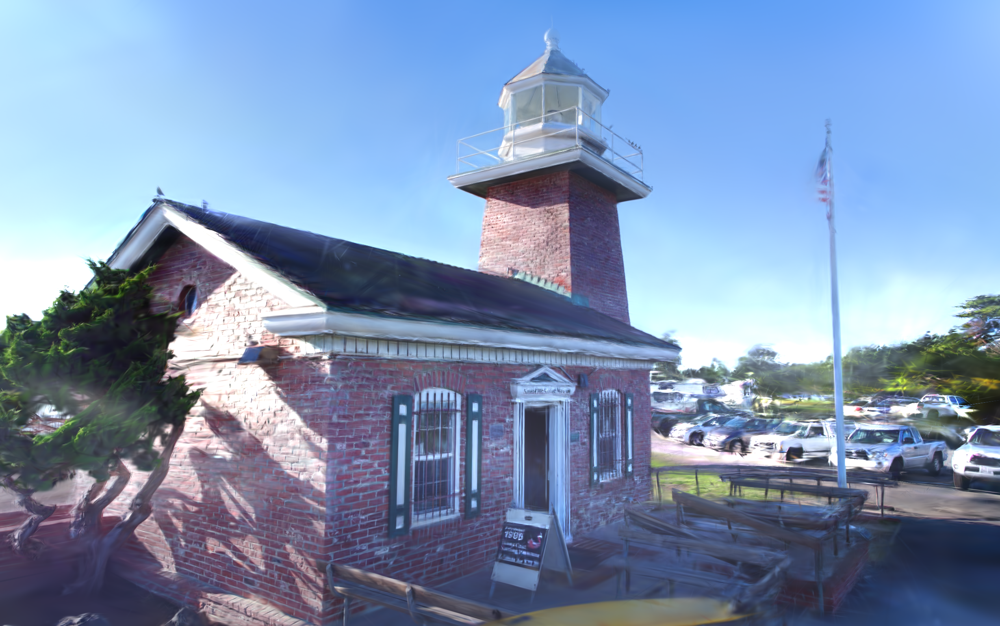</td>
    <td>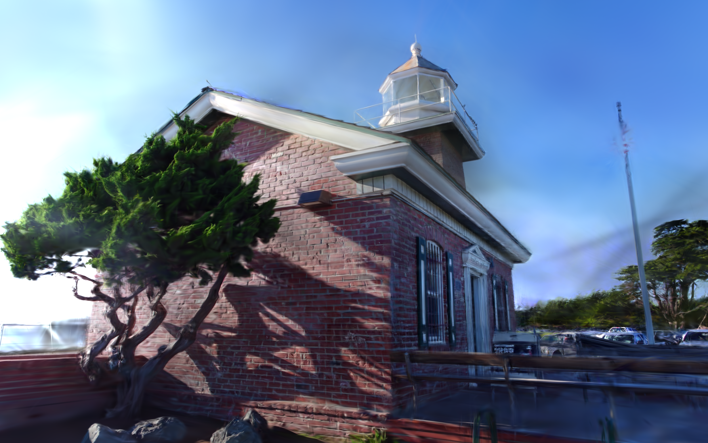</td>
  </tr>
  <tr>
    <td>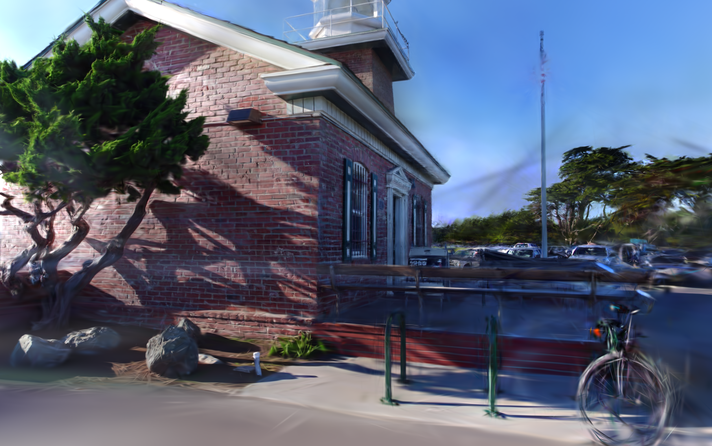</td>
    <td>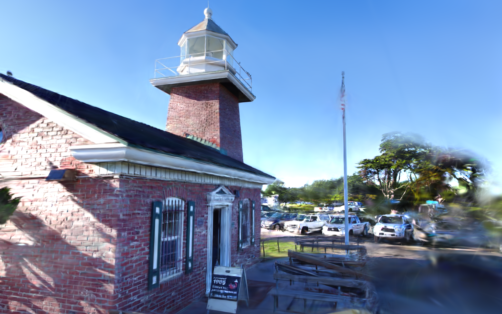</td>
  </tr>
  <tr>
    <td>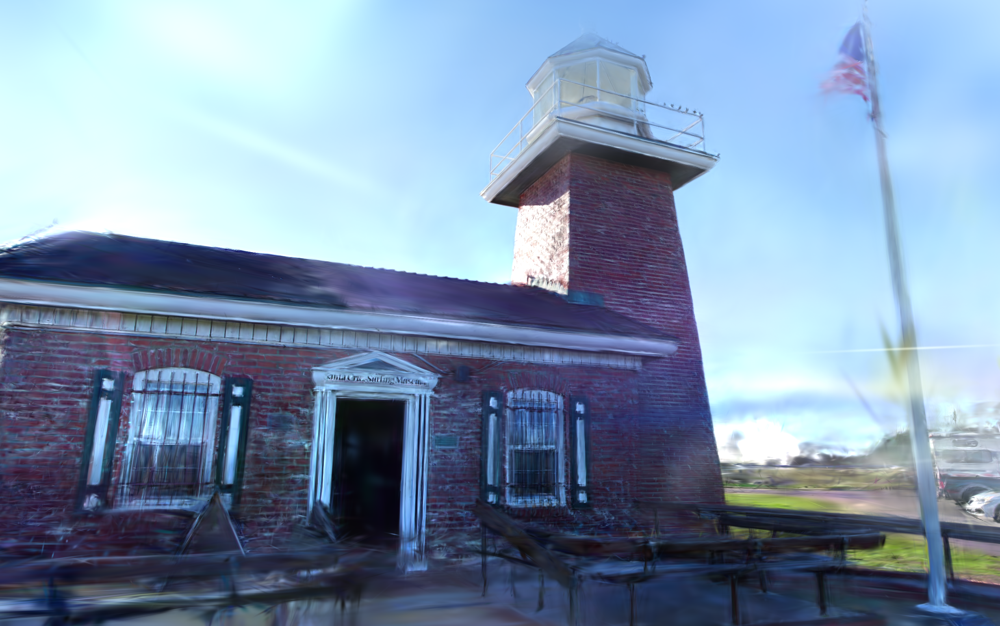</td>
    <td>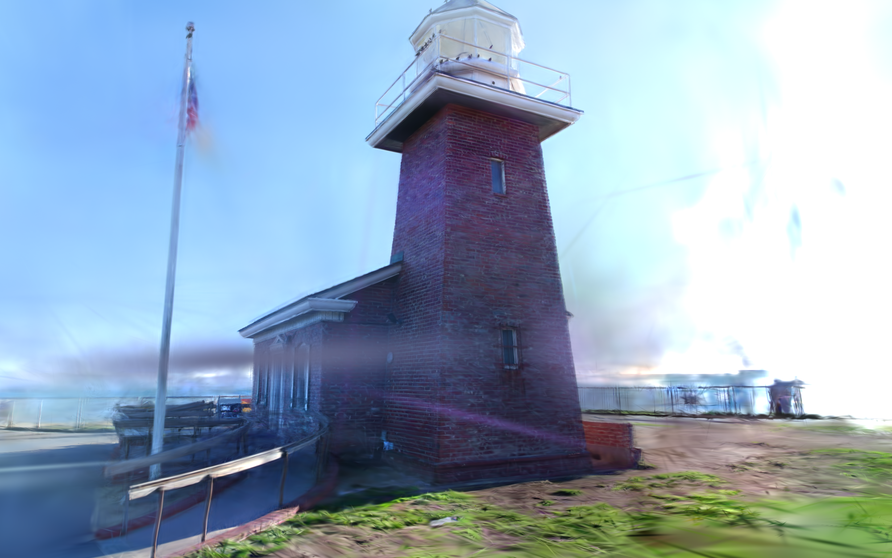</td>
  </tr>
  <tr>
    <td>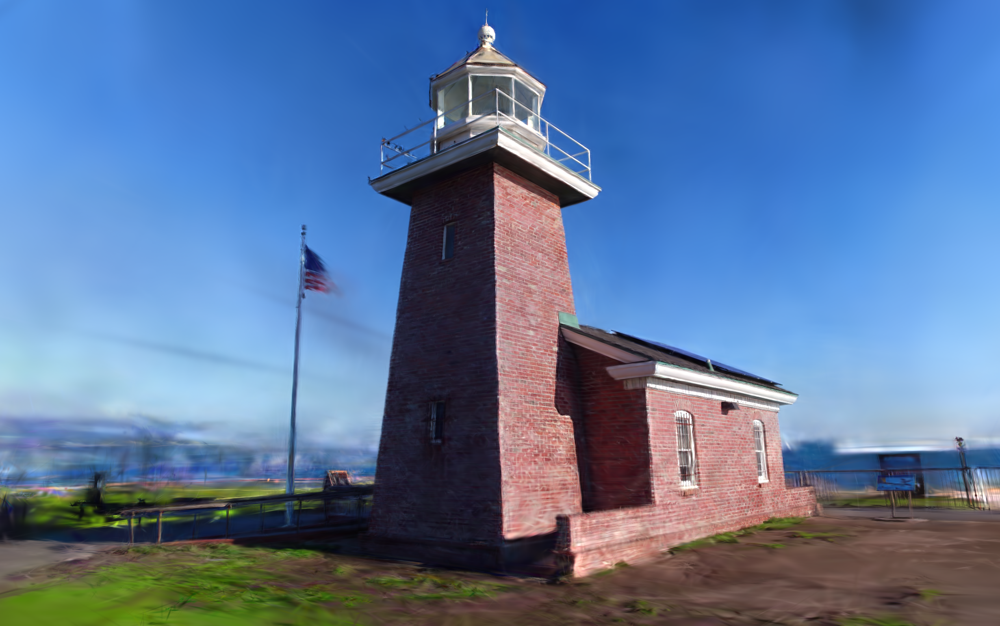</td>
    <td>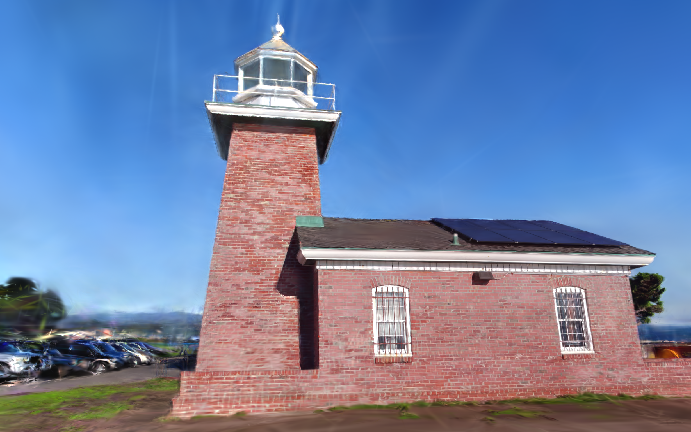</td>
  </tr>
  <tr>
    <td>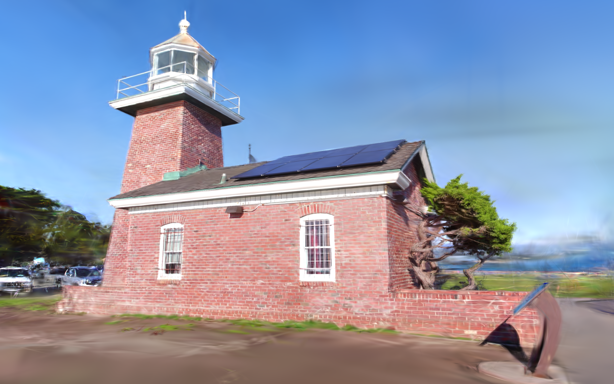</td>
    <td>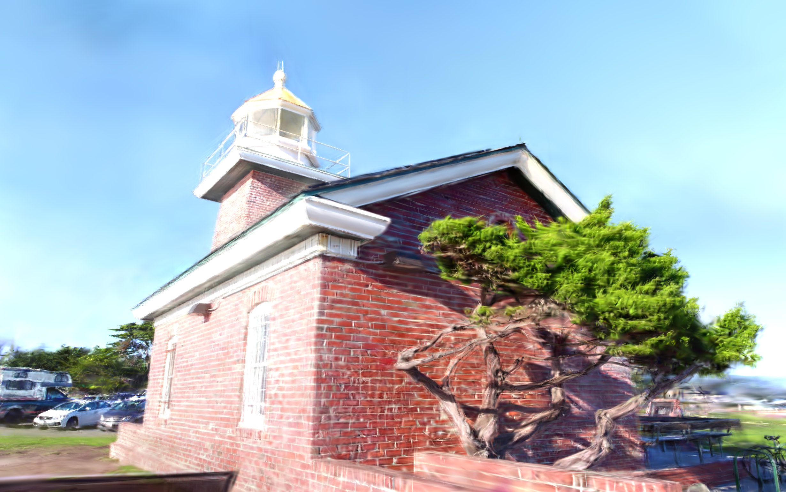</td>
  </tr>
  <tr>
    <td>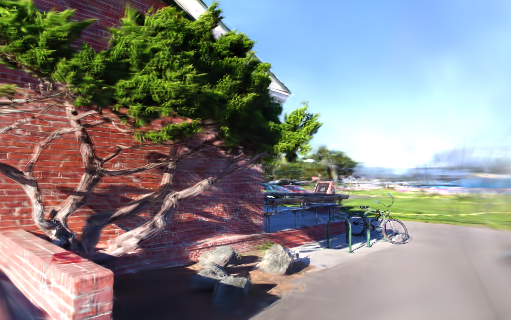</td>
    <td>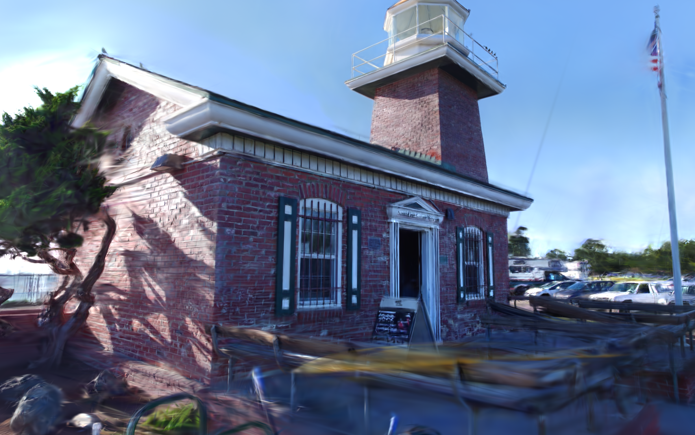</td>
  </tr>
  <tr>
    <td>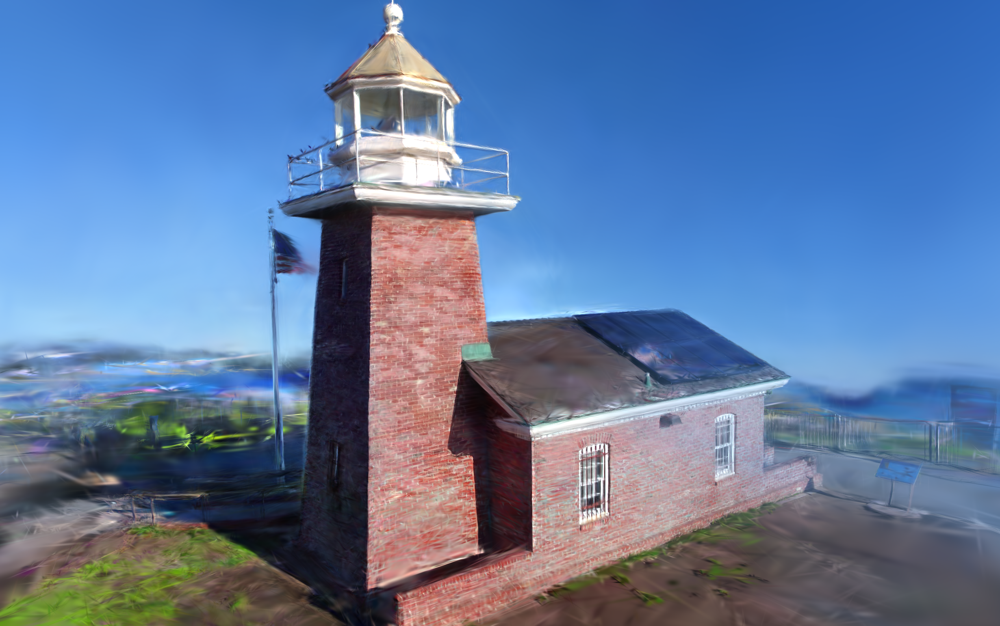</td>
    <td>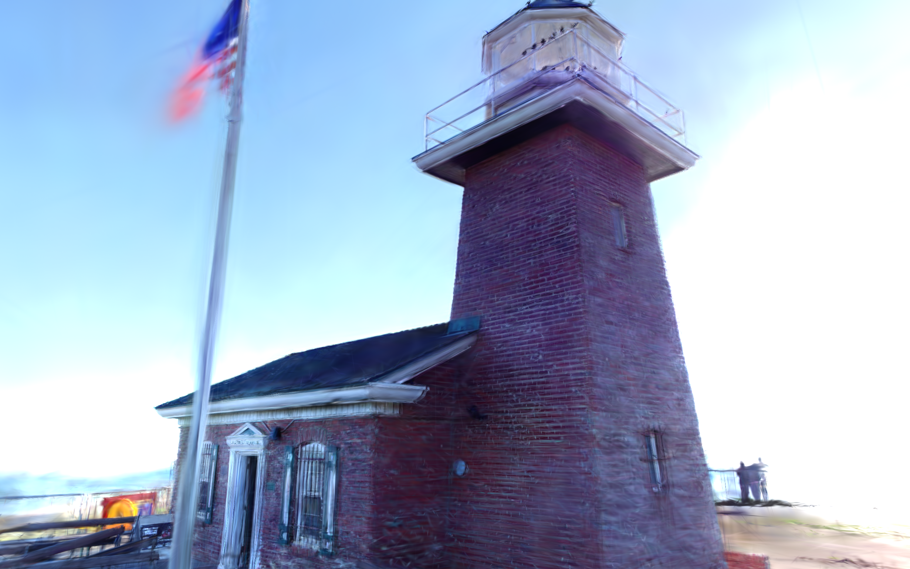</td>
  </tr>
</table>

> 交互式查看：将 `output/<model_folder>/point_cloud/iteration_30000/point_cloud.ply` 拖入 [Supersplat](https://superspl.at/editor) 即可在线浏览。

---

## 重建流程

```
视频抽帧 → 特征提取 (SuperPoint) → 特征匹配 (LightGlue)
→ 增量式 SfM (COLMAP) → 去畸变 → 3DGS 辐射场优化
```

### 技术路线说明

传统 SfM 管线使用 SIFT 提取特征，在重复纹理（如规则砖墙）和弱纹理区域（如金属栏杆、玻璃）容易出现误匹配，导致点云空洞或位姿估计失败。本项目做了两处改进：

1. **前端**：用 SuperPoint 替代 SIFT，利用全卷积网络提取全局语义特征；再用 LightGlue 的 Transformer 交叉注意力机制建立匹配，比最近邻搜索更鲁棒。
2. **匹配策略**：针对 300+ 张图像的环绕拍摄场景，采用窗口大小 `w=10` 的滑动窗口序列匹配，避免穷举 O(N^2) 带来的冗余计算，匹配对数从约 47,000 降至 3,000 量级。

在消费级 RTX 4060 Laptop（8 GB VRAM）上，通过 `max_keypoints=2048`、混合精度推理和 `-r 4` 渲染降采样，显存峰值控制在约 6.8 GB，可以跑完全流程。

---

## 环境依赖

| 组件 | 版本 | 说明 |
|------|------|------|
| 操作系统 | Windows 11 / Ubuntu 22.04 | 已验证 |
| Python | >= 3.10 | 推荐 3.10 |
| PyTorch | 2.2.2 | 需匹配本地 CUDA 版本（如 12.1） |
| GPU | NVIDIA RTX 4060 8GB | 已验证可运行 |

### 安装依赖

```bash
pip install -r requirements.txt
```

requirements.txt 中只列出了基础 Python 包。以下三个库需要单独克隆安装：

```bash
# 在项目同级目录创建 third_party/
mkdir ../third_party && cd ../third_party

# 1. Hierarchical-Localization (hloc) - 封装 SuperPoint + LightGlue + COLMAP
git clone https://github.com/cvg/Hierarchical-Localization.git
cd Hierarchical-Localization && pip install -e . && cd ..

# 2. LightGlue
git clone https://github.com/cvg/LightGlue.git
cd LightGlue && pip install -e . && cd ..

# 3. 3D Gaussian Splatting (需 CUDA 编译 C++ 扩展)
git clone https://github.com/graphdeco-inria/gaussian-splatting.git
cd gaussian-splatting && pip install -r requirements.txt
```

---

## 快速开始

以下命令假设当前处于项目根目录（`README.md` 所在目录）。

### 1. 视频抽帧

```bash
ffmpeg -i your_video.mp4 -vf "fps=328/153" -q:v 2 ../data/images/frame_%04d.jpg
```

### 2. 特征提取与稀疏重建

```bash
python src/run_LightGlue.py \
    --image_dir ../data/images/LightHouse \
    --output_dir ../models/LightHouse_309
```

参数说明：
- `--image_dir`: 输入图像目录
- `--output_dir`: 输出目录（存放 COLMAP 数据库和稀疏重建结果）
- `--window`: 滑动窗口大小，默认 10
- `--max_keypoints`: 每张图最大特征点数，默认 2048
- `--resize_max`: 预处理最长边，默认 1200

### 3. COLMAP 去畸变

将 COLMAP 的相机模型转换为针孔模型（Pinhole），去除镜头畸变，满足 3DGS 的输入要求。

```bash
colmap image_undistorter \
    --image_path ../data/images/LightHouse  \
    --input_path ../models/LightHouse_309 \
    --output_path ../models/LightHouse_309_PINHOLE \
    --output_type COLMAP
```

### 4. 3DGS 训练

```bash
python src/train.py \
    -s ../models/LightHouse_309_PINHOLE \
    -r 4 \
    --iterations 30000
```

- `-s`: 输入目录（去畸变后的 COLMAP 输出）
- `-r 4`: 渲染分辨率降采样 4 倍，降低显存占用
- `--iterations 30000`: 训练迭代次数

### 5. 查看模型

**本地 SIBR Viewer**：

```bash
# 需将 SIBR 查看器二进制文件放在 ../tools/ 下
../tools/SIBR_gaussianViewer_app -m ./output/<model_folder>
```

**在线浏览**：

打开 [Supersplat](https://superspl.at/editor)，将 `point_cloud.ply` 拖入浏览器窗口。

---

## 项目结构

本仓库只包含代码和文档，数据集、模型输出和第三方库放在仓库外部，通过 `.gitignore` 排除。

```
SEU-DIP-Final-project-3D-reconstruction/    <-- 本仓库
├── src/
│   ├── run_LightGlue.py      # 深度学习前端：SuperPoint + LightGlue + COLMAP SfM
│   ├── run_baseline.py       # 传统基线：SIFT + COLMAP（对比实验用）
│   └── train.py              # 3DGS 训练脚本（已适配相对路径）
├── assets/                    # README 展示用截图
├── docs/                      # 补充文档
├── report.md                  # 课程设计报告（完整理论推导与实验）
├── requirements.txt           # Python 依赖
└── README.md                  # 本文件

../data/                       # 原始图像和视频（不入 Git）
../models/                     # COLMAP 稀疏重建与 3DGS 输出（不入 Git）
../third_party/                # Hierarchical-Localization, LightGlue, gaussian-splatting
../tools/                      # SIBR Viewer 二进制与资源文件
```

---

## 实验参数与结果

| 参数 | 值 | 说明 |
|------|------|------|
| 图像数量 | 309（灯塔）/ 328（千弓楼） | 4K 视频环绕抽帧 |
| 特征点数 | 2048 / 图 | max_keypoints |
| 滑动窗口 | 10 | 每帧只与前后 10 帧匹配 |
| 3DGS 分辨率 | -r 4 | 960×540，适配 8GB 显存 |
| 训练迭代 | 30000 | 3DGS 优化 |
| 显存峰值 | ~6.8 GB | LightGlue + 3DGS 全过程 |
| 重建结果 | 601,704 高斯 | 30,000 次迭代后 |
| PSNR | 25.35 dB | 训练视角 |

---

## 课程报告

详细的设计思路、算法推导、消融实验和踩坑记录见 [report.md](report.md)。

---

## 参考文献

1. Kerbl, B., et al. "3D Gaussian Splatting for Real-Time Radiance Field Rendering." *ACM TOG*, 2023.
2. Schönberger, J. L., & Frahm, J. M. "Structure-from-Motion Revisited." *CVPR*, 2016.
3. DeTone, D., et al. "SuperPoint: Self-Supervised Interest Point Detection and Description." *CVPRW*, 2018.
4. Lindenberger, P., et al. "LightGlue: Local Feature Matching at Light Speed." *ICCV*, 2023.

---

## 许可

本项目为东南大学数字图像处理课程设计，开源仅供学习交流。
